# Plan de equipo — Diego, Ruby, Felix

Reparto de trabajo sobre lo ya definido en [SPEC_WIRE_DESK.md](SPEC_WIRE_DESK.md) (secciones 9–10). Tres tracks paralelos que convergen en `apps/channel`, más el checklist de entrega de [hackathon-rules.md](../hackathon-rules.md). Ajustar nombres/horas si el reparto de fuerte no coincide con quién sabe qué.

## Tracks en paralelo

```mermaid
gantt
    dateFormat  HH:mm
    axisFormat  %H:%M
    todayMarker off

    section Felix — backend / tools
    store.ts (archivo de decisiones)      :a1, 00:00, 2h
    log_decision + get_format_stats       :a2, after a1, 2h
    manejo de error (Exa falla, log vacío):a3, after a2, 1h

    section Ruby — componentes / prompt
    MasterBriefCard + EditionCard         :b1, 00:00, 2h
    FormatStatsCard                       :b2, after b1, 1h
    WIRE_DESK_ROLE en prompt.ts           :b3, after b2, 1h
    registrar todo en channel.tsx         :b4, after b3, 1h

    section Diego — contenido / demo / submission
    tema real + mensajes de ejemplo       :c1, 00:00, 1h
    ensayo del guion de demo (sección 9)  :c2, 00:00, 2h
    SUBMISSION.md + título + descripción  :c3, after c2, 1h

    section Todos
    integración conjunta en apps/channel  :crit, d1, after a3, 2h
    npm run verify + prueba end-to-end    :crit, d2, after d1, 1h
    grabar video de 2 min                 :crit, d3, after d2, 1h
    post en redes + submit                :crit, d4, after d3, 1h
```

Los tiempos son relativos (bloques de trabajo, no reloj) — acomodarlos contra el deadline real de la ciudad en el participant portal, no inventar una hora.

## Felix — backend / tools

Dueño natural de este track porque ya conoce el andamiaje del kit (`apps/channel`, `agent-core`).

- [ ] `apps/channel/src/store.ts` (nuevo): leer/escribir el archivo de decisiones. JSON en disco alcanza — no hace falta una base de datos para la demo.
- [ ] `apps/channel/src/tools.tsx`: agregar `log_decision` (guarda idea, tendencia origen, plataforma, fecha) y `get_format_stats` (agrega conteos por formato), junto al `read_thread` que ya existe.
- [ ] Manejo de error explícito: si `search_web` falla, el agente lo dice y sigue con el hilo; si el archivo de decisiones está vacío, `get_format_stats` responde "todavía no hay datos" en vez de romper.

## Ruby — componentes / prompt

- [ ] `apps/channel/src/components.tsx`: `MasterBriefCard` (Gancho/Desarrollo/Cierre/Nota visual) y `EditionCard` con un botón por plataforma, mismo patrón que `IncidentCard`/`proposeAction` — el click escribe la decisión y actualiza la card, sin volver a llamar al agente.
- [ ] `FormatStatsCard`: tabla de formato → veces elegido → última vez, en el estilo de `Timeline`.
- [ ] `packages/agent-core/src/prompt.ts`: nuevo `WIRE_DESK_ROLE` que reemplaza `ONCALL_ROLE` (dejar `SURFACE_RULES` intacto).
- [ ] `apps/channel/src/channel.tsx`: registrar los tools/components nuevos, ajustar `context` y `welcomeMessage` al dominio de contenido en vez de incidentes.

## Diego — contenido, demo y entrega

- [ ] Definir el tema real para la demo (nicho, plataformas objetivo) — nada de datos inventados en el video.
- [ ] Escribir 2–3 mensajes de contexto reales para el hilo antes de la mención al agente.
- [ ] Ensayar el guion de la sección 9 (≤ 90s) hasta que corra sin baches.
- [ ] Completar [SUBMISSION.md](../SUBMISSION.md): título del proyecto, descripción (qué hace, para quién, por qué importa el canal), y qué se construyó durante el evento vs. qué venía del starter kit.
- [ ] Preparar el post público de redes sociales tageando a los sponsors según las instrucciones del organizador.

## Checkpoint conjunto

1. Integrar los tres tracks en `apps/channel` (Felix + Ruby primero, Diego prueba como si fuera el creador).
2. `npm run verify` (typecheck + tests offline) y una corrida real end-to-end en Slack.
3. Grabar el video de 2 minutos siguiendo el guion ya ensayado.
4. Revisar el checklist de [SUBMISSION.md#evidence-for-the-judging-criteria](../SUBMISSION.md) contra los cuatro criterios antes de enviar.
