# Plan de equipo — Diego, Ruby, Felix

Reparto de trabajo sobre lo ya definido en [SPEC_WIRE_DESK.md](SPEC_WIRE_DESK.md) (secciones 9–10). Tres tracks paralelos que convergen en `apps/channel`, más el checklist de entrega de [hackathon-rules.md](../hackathon-rules.md). Ajustar nombres/horas si el reparto de fuerte no coincide con quién sabe qué.

## Tracks en paralelo

```mermaid
gantt
    dateFormat  HH:mm
    axisFormat  %H:%M
    todayMarker off

    section Felix — backend / tools
    store.ts (archivo de decisiones)      :a1, 00:00, 2h
    log_decision + get_format_stats       :a2, after a1, 2h
    manejo de error (Exa falla, log vacío):a3, after a2, 1h

    section Ruby — componentes visuales
    MasterBriefCard + EditionCard         :b1, 00:00, 2h
    FormatStatsCard                       :b2, after b1, 1h

    section Diego — señal, prompt y wiring
    search_web → detección de tendencias  :c1, 00:00, 1h30m
    WIRE_DESK_ROLE en prompt.ts           :c2, after c1, 1h30m
    registrar todo en channel.tsx         :c3, after c2, 1h
    tema real + mensajes de ejemplo       :c4, after c3, 1h

    section Todos
    ensayo del guion de demo (juntos)     :d0, after a3, 1h
    integración conjunta en apps/channel  :crit, d1, after d0, 2h
    npm run verify + prueba end-to-end    :crit, d2, after d1, 1h
    grabar video de 2 min                 :crit, d3, after d2, 1h
    SUBMISSION.md + post en redes         :crit, d4, after d3, 1h
```

Los tiempos son relativos (bloques de trabajo, no reloj) — acomodarlos contra el deadline real de la ciudad en el participant portal, no inventar una hora.

## Felix — backend / tools

Dueño natural de este track porque ya conoce el andamiaje del kit (`apps/channel`, `agent-core`).

- [ ] `apps/channel/src/store.ts` (nuevo): leer/escribir el archivo de decisiones. JSON en disco alcanza — no hace falta una base de datos para la demo.
- [ ] `apps/channel/src/tools.tsx`: agregar `log_decision` (guarda idea, tendencia origen, plataforma, fecha) y `get_format_stats` (agrega conteos por formato), junto al `read_thread` que ya existe.
- [ ] Manejo de error explícito: si `search_web` falla, el agente lo dice y sigue con el hilo; si el archivo de decisiones está vacío, `get_format_stats` responde "todavía no hay datos" en vez de romper.

## Ruby — componentes visuales

- [ ] `apps/channel/src/components.tsx`: `MasterBriefCard` (Gancho/Desarrollo/Cierre/Nota visual) y `EditionCard` con un botón por plataforma, mismo patrón que `IncidentCard`/`proposeAction` — el click escribe la decisión y actualiza la card, sin volver a llamar al agente.
- [ ] `FormatStatsCard`: tabla de formato → veces elegido → última vez, en el estilo de `Timeline`.

## Diego — señal, prompt y wiring

Track más técnico: es la parte de "detección" (sección 2, paso 01) que había quedado sin dueño explícito, más el cableado que conecta todo.

- [ ] `apps/channel/src/search.tsx`: el tool `search_web` ya existe (Exa) pero su `description` y el uso que hace de él el agente están redactados para incidentes ("error messages, dependency behaviour, third-party status"). Reescribirlo para señal de tendencia: qué está resonando ahora sobre el tema que ya se discutió en el hilo.
- [ ] `packages/agent-core/src/prompt.ts`: nuevo `WIRE_DESK_ROLE` que reemplaza `ONCALL_ROLE` (dejar `SURFACE_RULES` intacto) — acá se le dice al agente cuándo llamar a `search_web` para detectar tendencia vs. cuándo alcanza con `read_thread`.
- [ ] `apps/channel/src/channel.tsx`: registrar los tools/components nuevos, ajustar `context` y `welcomeMessage` al dominio de contenido en vez de incidentes.
- [ ] Definir el tema real para la demo (nicho, plataformas objetivo) y escribir los 2–3 mensajes de contexto que van a estar en el hilo antes de la mención — nada inventado en el video.

## Todos juntos

- [ ] Ensayar el guion de la sección 9 (≤ 90s) los tres, hasta que corra sin baches.
- [ ] Integrar los tres tracks en `apps/channel` y probarlo como si uno fuera el creador.
- [ ] `npm run verify` (typecheck + tests offline) y una corrida real end-to-end en Slack.
- [ ] Grabar el video de 2 minutos.
- [ ] Completar [SUBMISSION.md](../SUBMISSION.md) (título, descripción, qué se hizo durante el evento vs. starter kit) y el post público de redes tageando a los sponsors.
- [ ] Repasar el checklist de [SUBMISSION.md#evidence-for-the-judging-criteria](../SUBMISSION.md) contra los cuatro criterios antes de enviar.
