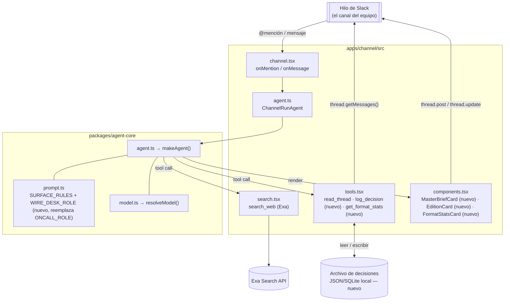
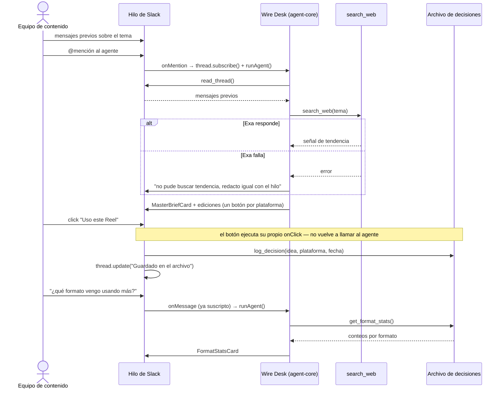
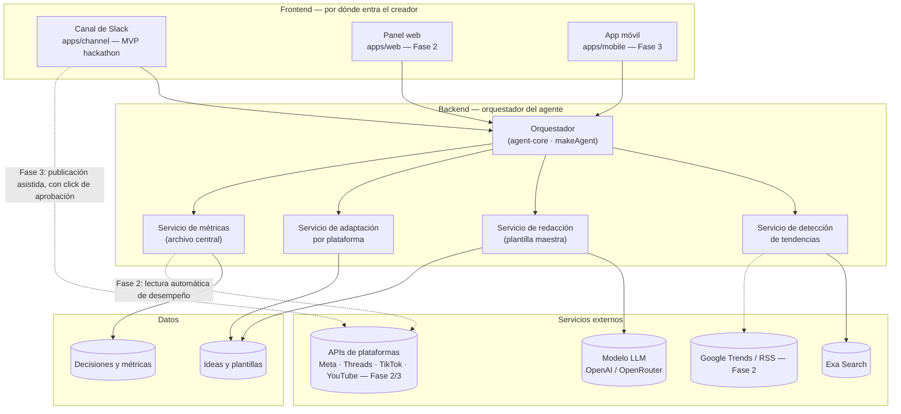

# Wire Desk — Agente de Publicaciones Multiplataforma

> **Estado:** concepto — sin construir
> **Archivado:** 12 sep 2026
> **Para:** creadores independientes y equipos chicos de contenido

---

## 1. La tesis

El problema no es la falta de ideas. Es el tiempo que se va en tres tareas separadas:

- **Rastrear** qué está resonando ahora.
- **Reescribir** la misma idea seis veces para seis formatos distintos.
- **Recordar** qué formato viene funcionando mejor para este creador en particular, no en promedio de mercado.

Wire Desk ataca las tres a la vez con un solo recorrido: detecta una señal de tendencia relevante al nicho, la redacta como un prototipo modular editable, deja que ese prototipo se derrame en variantes por plataforma respetando las reglas reales de cada una, y archiva qué formato eligió el creador para poder comparar con el tiempo.

## 2. El recorrido

El nombre viene de cómo trabajaba una agencia de noticias: una historia se filiaba una sola vez y corría, con distinta extensión, en decenas de ediciones. Acá la "historia" es la idea de contenido.

| Paso | Nombre | Qué hace |
|---|---|---|
| 01 · Señal | Detección | Rastrea tendencias filtradas por nicho y palabras clave del creador |
| 02 · Redacción | Plantilla maestra | Un modelo redacta un prototipo modular: gancho, desarrollo, cierre, nota visual |
| 03 · Ediciones | Adaptación | La plantilla se transforma en una variante por plataforma, según sus reglas reales |
| 04 · Redacción final | Revisión del creador | El creador edita, elige o descarta cada edición antes de publicar por su cuenta |
| 05 · Archivo | Métricas centrales | Se registra qué formato y plataforma se eligieron, y cómo les fue |

## 3. La plantilla maestra

Cada idea se redacta primero como un **bloque modular**, no como un post ya escrito para una red en particular. Esto es lo que hace posible que una sola idea corra en video, blog, feed y texto corto sin reescribirse desde cero cada vez:

- **Gancho** — la razón para seguir leyendo o mirando, en una línea.
- **Desarrollo** — un insight central, no una lista de todo lo que se podría decir.
- **Cierre** — una pregunta, un CTA o una idea que se queda dando vueltas.
- **Nota visual** — qué imagen, gráfico o plano acompaña la idea.

La adaptación por plataforma no es "cortar y pegar más corto": cada edición respeta el largo, el tono y el orden de lectura real de esa red.

| Plataforma | Edición | Medida real | Regla de oro |
|---|---|---|---|
| Instagram — feed | Carrusel de 3–10 slides o post único | Caption hasta 2200 caracteres; solo ~125 antes del "más" | El gancho vive en la primera línea del texto, no en la imagen |
| Reels / TikTok | Guion de video corto | 15–30s ideal; la retención cae después del segundo 3 | El gancho ocurre en el primer segundo, no en el título en pantalla |
| Threads | Post de texto | 500 caracteres por post | Una sola idea, tono conversacional, sin CTA forzado |
| Facebook | Post o video nativo | Sin límite duro; el engagement cae después de ~80 palabras | Video nativo por encima de link externo |
| Blog / newsletter | Artículo largo | 800–1500 palabras; título SEO <60 car.; meta <160 car. | El gancho es el primer párrafo, no el titular |
| X (Twitter) | Post o hilo | 280 caracteres por post | Hilo solo cuando la idea necesita más de dos remates |

## 4. De dónde vienen las señales

El MVP se apoya en fuentes públicas que no requieren permisos de plataforma: Google Trends, RSS de medios del nicho, hashtags públicos, foros como Reddit. Las APIs oficiales de cada red (Meta Graph API para Instagram/Facebook, la API de Threads, YouTube Data API, TikTok API) quedan para una fase posterior, porque piden aprobación previa y traen límites de uso propios.

Una distinción que el prototipo debe marcar siempre: inspirarse en una tendencia ajena no es lo mismo que copiarla. El agente propone un ángulo propio sobre la señal, no una réplica del formato viral original.

## 5. El archivo central

Lo que se guarda no es solo "se publicó esto acá": es fecha, tendencia de origen, plataforma y formato elegidos frente a los descartados y, cuando hay integración, alcance e interacciones. El valor no está en medir un post suelto — está en ver, con el tiempo, qué formato rinde mejor para *este* creador, no un promedio del mercado.

En el MVP esa carga es manual: el creador marca qué eligió publicar y pega el link o los números. La lectura automática vía API de cada plataforma es una fase posterior, no un requisito para empezar a aprender del patrón.

## 6. Alcance por fases

**MVP**
- Detección simple desde fuentes públicas
- Redacción de la plantilla maestra
- Ediciones para 3–4 plataformas
- Carga manual de métricas

**Fase 2**
- Fuentes de tendencia ampliadas
- Lectura automática de métricas vía API
- Panel comparativo por formato y plataforma

**Fase 3**
- Sugerencias propias del agente ("tu audiencia responde mejor a carrusel los martes")
- Publicación asistida, con confirmación explícita en cada envío

## 7. Decisiones abiertas

- **Alcance** — ¿es para un creador individual o para una agencia con varias cuentas? Cambia por completo el modelo de datos del archivo central.
- **Acceso** — las APIs oficiales de cada red no se aprueban de inmediato, y algunas (Threads) exponen todavía muy poco por API pública.
- **Derechos** — rastrear tendencias de terceros para inspirarse exige que el prototipo señale la fuente y proponga un ángulo propio, no una copia.
- **Permisos** — publicar en nombre del creador es una acción de alto impacto: no debería ocurrir nunca sin confirmación explícita, publicación por publicación.

## 8. Próximo paso

Antes de escribir una línea de código conviene validar con un creador real: qué plataformas usa hoy, cómo mide el desempeño ahora mismo, y qué tan seguido de verdad reescribe una idea para cada red. Eso decide si el MVP arranca por la plantilla maestra o por el archivo de métricas.

---

## 9. Adaptación a la rúbrica del hackathon (`apps/channel`)

`docs/ESTRATEGIA_JUECES_AI_TINKERERS.md` castiga cualquier cosa que se pueda reemplazar por una pestaña de ChatGPT. Wire Desk tal como está en las secciones 1–8 es un producto — para el hackathon hay que aterrizarlo en un entorno concreto donde el equipo ya habla, con mutación real de estado y control humano explícito. Eso es exactamente la **Opción B** de la estrategia ("Compañero Ambiental de Slack"), y el template `apps/channel` (CopilotKit Channels + Exa) ya trae el 80% de la infraestructura — es la misma app del incidente, con el dominio cambiado.

### Superficie y usuario

Un canal de Slack donde un equipo de contenido chico ya discute qué van a publicar ("che, vi que tal cosa está explotando", "¿hacemos algo del lanzamiento del jueves?"). El agente vive ahí, no en una app aparte.

**¿Para qué es Slack, puntualmente?** Es la superficie del agente, no un destino de publicación. La regla del hackathon pide construir el agente "for a place people already work, talk, or live" — Slack es donde el equipo *ya* discute ideas hoy, así que el agente lee ese contexto real (`read_thread`) en vez de arrancar de un prompt en blanco. Sacá el canal y perdés exactamente eso: el contexto gratis de lo que el equipo ya decidió, y el lugar natural para aprobar un formato con un click. Publicar de verdad a Instagram/TikTok/etc. queda fuera de alcance (sección 7) — Slack es donde se decide qué publicar, no por dónde sale.

### Recorrido, mapeado a las piezas que ya existen

| Paso original | Pieza en `apps/channel` | Qué cambia |
|---|---|---|
| 01 · Señal | `search_web` (Exa) en [`src/search.tsx`](../apps/channel/src/search.tsx) | Se usa para buscar señal de tendencia real sobre el tema que ya se está discutiendo, no research genérico de incidente |
| — contexto | `read_thread` en [`src/tools.tsx`](../apps/channel/src/tools.tsx) | Se reutiliza tal cual: lee lo que el equipo ya dijo del nicho/tema antes de redactar nada |
| 02 · Redacción | Nuevo `defineChannelComponent` `MasterBriefCard` (mismo patrón que `IncidentCard` en [`src/components.tsx`](../apps/channel/src/components.tsx)) | Dibuja los 4 bloques (Gancho / Desarrollo / Cierre / Nota visual) como card nativa, no como texto |
| 03 · Ediciones | `Table`/`Fields` por plataforma dentro de la misma card, o una card por plataforma | Cada edición respeta el límite real (tabla de la sección 3) |
| 04 · Revisión | `Actions` + `Button` por edición, siguiendo el patrón exacto de `propose_action` | Un click por plataforma dice "uso este formato" — el click **reporta una decisión, no ejecuta nada** (mismo guardrail que ya usa el incident demo) |
| 05 · Archivo | Nuevo tool `log_decision` + `get_format_stats` | `log_decision` escribe la elección (idea, tendencia origen, plataforma, fecha) en un almacén simple (JSON/SQLite local alcanza para la demo) — es la mutación de estado real que pide el criterio C. `get_format_stats` lee ese archivo y responde en el mismo hilo "¿qué formato me viene funcionando mejor?" |

### Por qué esto puntúa distinto a la versión dashboard

- **Core Requirements (C1):** el flujo cierra de punta a punta adentro de Slack — research → borrador → aprobación → log persistido → consulta posterior — sin que el usuario salte a otra pestaña.
- **Innovation/Theme (C2):** lo que se pierde si sacás el canal es concreto y se puede decir en la demo: el contexto gratis de lo que el equipo ya decidió en el hilo, y que el "archivo central" se llena con decisiones reales tomadas donde se toman, no en una herramienta que nadie abre.
- **Technical Execution (C3):** reusa `read_thread` y `search_web`, suma dos tools nuevos con escritura real de estado, y tiene una salida de error natural para mostrar: si Exa falla, el agente redacta igual con lo que hay en el hilo y lo dice explícitamente (no falla silencioso).
- **Usefulness (C4):** el guardrail ya probado en el incident demo — el click aprueba/registra, nunca publica — es literalmente el mismo mecanismo de control humano que la sección 7 de este doc pedía para "publicar en nombre del creador".

### Qué hace falta para el 5, no solo el 3, en cada eje

El rubric oficial distingue "funciona básico" (3) de "robusto" (5). Para este proyecto, la diferencia concreta es:

| Criterio | El 3 (mínimo viable) | El 5 (a qué apuntar) |
|---|---|---|
| Core Requirements | El agente lee el hilo y postea una `MasterBriefCard` una vez, en una demo controlada | El flujo corre de punta a punta sin intervención manual — research → card → click → log → consulta — y sobrevive a un hilo real con ruido (mensajes que no son sobre el tema) |
| Innovation & Theme | El agente "aparece" en Slack pero el research podría hacerse igual en un chatbox aparte | El punto de partida de cada idea es literalmente algo que el equipo ya escribió en el hilo — sacá el canal y el agente no tiene de qué partir; eso hay que poder decirlo en la demo en una frase |
| Technical Execution | Los tools nuevos (`log_decision`, `get_format_stats`) existen pero sin manejo de error | Si Exa falla, el agente lo dice y redacta igual con el hilo; si el archivo de decisiones está vacío, `get_format_stats` no rompe — responde que todavía no hay datos |
| Usefulness | El equipo puede ver las ediciones y elegir una | La elección queda grabada sin fricción (un click, no un formulario) y la próxima vez que preguntan "qué me viene funcionando" la respuesta usa decisiones reales del equipo, no un promedio inventado |

### Recorte de alcance para la demo (2 días)

Sacar de la demo: publicación real a redes (queda como Fase 3, igual que en la sección 6), y el panel web separado — `get_format_stats` haciendo de dashboard adentro del hilo alcanza para las 48 horas del hackathon. `apps/web` como panel comparativo real queda anotado como Fase 2, no como parte del MVP del hackathon.

### Guion de demo (≤ 90s)

1. Canal con 2–3 mensajes previos sobre un tema real del creador.
2. @mención al agente → lee el hilo, busca señal con Exa, postea `MasterBriefCard` + ediciones por plataforma.
3. Click en "Uso este Reel" → la card se actualiza a "Guardado en el archivo" (sin publicar nada).
4. Pregunta de seguimiento en el mismo hilo: "¿qué formato vengo eligiendo más este mes?" → el agente responde con la tabla de `get_format_stats`.

---

## 10. Arquitectura

Componentes y dónde vive cada uno, con nombres reales del repo (`apps/channel/src`, `packages/agent-core`). Lo único que no existe todavía es el archivo de decisiones y los dos tools que lo leen/escriben.

Flujo de la demo, con el detalle que importa para el criterio técnico: **el click de aprobación nunca vuelve a pasar por el agente** — el botón corre su propio handler y escribe directo al archivo, igual que ya hace `propose_action` con las decisiones de incidentes.

### Piezas nuevas a construir

| Archivo | Qué agrega |
|---|---|
| `apps/channel/src/store.ts` (nuevo) | Lectura/escritura del archivo de decisiones — JSON o SQLite local alcanza para la demo |
| `apps/channel/src/tools.tsx` | Sumar `log_decision` y `get_format_stats` junto a `read_thread` |
| `apps/channel/src/components.tsx` | Sumar `MasterBriefCard`, `EditionCard` (o `Table` de ediciones) y `FormatStatsCard`, con el mismo patrón que `IncidentCard`/`Timeline` |
| `apps/channel/src/channel.tsx` | Registrar los tools/components nuevos en `tools`/`components`, y ajustar el `context` y `welcomeMessage` al dominio de contenido |
| `packages/agent-core/src/prompt.ts` | Nuevo `WIRE_DESK_ROLE` que reemplaza `ONCALL_ROLE`; `SURFACE_RULES` se reutiliza sin tocar |

## 11. Arquitectura del producto completo (frontend / backend / servicios)

La sección 10 es el recorte que entra en las 48 horas del hackathon (todo adentro de `apps/channel`). Esto es la idea completa de las secciones 1–8 si se construyera como producto, con Slack como una superficie más, no la única.

Notas de lectura:

- Las líneas punteadas son Fase 2/3 — nada de eso se construye para el hackathon.
- El "orquestador" no es un servicio nuevo aparte: es `makeAgent()` de `packages/agent-core`, el mismo para las tres superficies. Cada frontend le pasa su propio contexto (hilo de Slack, página web, pantalla del móvil).
- `DETECT`, `DRAFT`, `ADAPT` y `METRICS` en el MVP no son microservicios separados — son los tools (`search_web`, `log_decision`, `get_format_stats`) y components (`MasterBriefCard`, etc.) que ya mapeamos en la sección 10. Se dibujan como servicios acá para mostrar hacia dónde escalan si el producto crece más allá de un solo canal de Slack.
